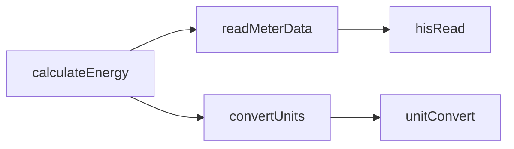

# Enhanced Function Metadata with AST Parsing

## Overview

Using AST (Abstract Syntax Tree) parsing, we can extract rich metadata about each Axon function to dramatically improve caching, searching, and code intelligence.

## Current Metadata (Basic)

```json
{
  "name": "calculateEnergy",
  "lastModified": "2025-10-01T05:00:00Z",
  "hash": "a1b2c3d4",
  "synced": "2025-10-01T05:26:22Z"
}
```

## Proposed Enhanced Metadata

```typescript
interface EnhancedFunctionMetadata {
  // Basic Info
  name: string;
  lastModified?: string;
  hash: string;
  synced: string;
  
  // ===== AST-Extracted Metadata =====
  
  // 1. Function Signature
  signature: {
    parameters: Array<{
      name: string;
      type?: string;          // Inferred or documented type
      defaultValue?: string;
      required: boolean;
      description?: string;
    }>;
    returnType?: string;      // Inferred return type
    isAsync: boolean;         // Uses async operations?
  };
  
  // 2. Dependencies
  dependencies: {
    functions: string[];      // Other functions called
    tags: string[];           // Tags/markers used (ahu, point, equip, etc.)
    queries: string[];        // Haystack queries (readAll, read, etc.)
    externalApis: string[];   // HTTP calls, external services
  };
  
  // 3. Code Complexity
  complexity: {
    linesOfCode: number;
    cyclomaticComplexity: number;  // Number of decision points
    nestedDepth: number;           // Max nesting level
    commentRatio: number;          // Comments / total lines
  };
  
  // 4. Data Operations
  operations: {
    reads: string[];          // Data sources read from
    writes: string[];         // Data targets written to
    commits: boolean;         // Uses commit()?
    jobs: boolean;            // Schedules jobs?
    emails: boolean;          // Sends emails?
  };
  
  // 5. Documentation
  documentation: {
    description: string;
    examples: string[];       // Usage examples
    author?: string;
    version?: string;
    lastUpdatedBy?: string;
    notes: string[];          // Additional notes/warnings
  };
  
  // 6. Usage Patterns
  patterns: {
    category: string;         // HVAC, Energy, Reporting, etc.
    subcategory?: string;     // AHU, VAV, Meter, etc.
    keywords: string[];       // Extracted important terms
    useCase: string;          // What problem does it solve?
  };
  
  // 7. Performance Hints
  performance: {
    estimatedRuntime: string; // "fast" | "medium" | "slow" | "batch"
    hasLoops: boolean;
    hasRecursion: boolean;
    datasetSize: string;      // "small" | "medium" | "large"
  };
  
  // 8. Site/Project Specific
  context: {
    siteSpecific: boolean;    // Uses site-specific tags/refs?
    projectName: string;
    instanceName: string;
    sharedAcrossProjects: boolean;
  };
  
  // 9. Quality Metrics
  quality: {
    hasDocumentation: boolean;
    hasExamples: boolean;
    hasErrorHandling: boolean;
    hasTests: boolean;
    lastReviewed?: string;
  };
  
  // 10. Relationships
  relationships: {
    similarFunctions: string[];    // Functions with similar logic
    relatedEquipTypes: string[];   // Works with AHU, VAV, etc.
    prerequisiteFunctions: string[]; // Must exist for this to work
    deprecatedBy?: string;         // If replaced by newer function
  };
}
```

## How to Extract This Data

### 1. **Function Signature** (AST-based)

```typescript
// Parse: (temp: Number, setpoint: Number = 72) => do
signature: {
  parameters: [
    { name: "temp", type: "Number", required: true },
    { name: "setpoint", type: "Number", defaultValue: "72", required: false }
  ],
  returnType: "Grid",
  isAsync: false
}
```

### 2. **Dependencies** (Code Analysis)

```typescript
// Scan for: readAll(ahu), temp, kwh, httpGet()
dependencies: {
  functions: ["calculateDelta", "sendEmail"],
  tags: ["ahu", "temp", "cooling"],
  queries: ["readAll", "read", "hisRead"],
  externalApis: ["httpGet", "httpPost"]
}
```

### 3. **Code Complexity** (AST Metrics)

```typescript
complexity: {
  linesOfCode: 45,
  cyclomaticComplexity: 8,      // if/else, loops, conditions
  nestedDepth: 3,               // Max indentation
  commentRatio: 0.25            // 25% comments
}
```

### 4. **Data Operations** (Pattern Matching)

```typescript
operations: {
  reads: ["point", "equip", "site"],
  writes: ["hisWrite", "commit"],
  commits: true,                 // Uses commit()
  jobs: false,
  emails: true                   // Uses ioSendEmail()
}
```

### 5. **Documentation** (Comment Parsing)

```typescript
/**
 * Calculate energy consumption for AHUs
 * 
 * @param dateRange Date range for analysis
 * @param site Optional site filter
 * @returns Grid of energy values
 * @example calculateAhuEnergy(lastWeek())
 * @author John Doe
 * @version 2.0
 */
```

## Benefits

### 1. **Intelligent Search**

```typescript
// Find all functions that:
// - Work with AHUs
// - Write data (commit)
// - Are not site-specific
// - Have good documentation

search({
  dependencies: { tags: ["ahu"] },
  operations: { commits: true },
  context: { siteSpecific: false },
  quality: { hasDocumentation: true }
})
```

### 2. **Dependency Graph**



### 3. **Code Quality Dashboard**

```
Project: demoProject
Functions: 127
------------------------
✅ Well-documented: 85%
⚠️  Missing examples: 45%
❌ High complexity: 12%
📊 Average LOC: 35 lines
```

### 4. **Smart Recommendations**

```typescript
// User searches: "ahu cooling"
// System suggests:
{
  exactMatches: ["ahuCoolingAnalysis", "ahuCoolingSpark"],
  relatedFunctions: ["ahuHeatingAnalysis", "vahCoolingAnalysis"],
  prerequisites: ["readAhuPoints", "calculateDelta"],
  complexity: "medium",
  estimatedRuntime: "fast"
}
```

### 5. **Reusability Index**

```typescript
// Functions that can be reused across projects
{
  name: "calculateDelta",
  siteSpecific: false,
  sharedAcrossProjects: true,
  usedIn: ["demoProject", "mobilytik", "microsoft"],
  reusabilityScore: 0.95
}
```

### 6. **Performance Insights**

```typescript
// Functions that might be slow
{
  slowFunctions: [
    {
      name: "processAllPoints",
      linesOfCode: 250,
      hasLoops: true,
      datasetSize: "large",
      estimatedRuntime: "slow"
    }
  ]
}
```

## Implementation Strategy

### Phase 1: Enhanced Parser (Week 1)

```typescript
// src/parser/enhancedAxonParser.ts
export class EnhancedAxonParser extends AxonParser {
  
  parseEnhancedFunction(source: string): EnhancedFunctionMetadata {
    // Extract all metadata using AST analysis
  }
  
  extractDependencies(ast: AST): Dependencies {
    // Find function calls, tag usage, queries
  }
  
  calculateComplexity(ast: AST): Complexity {
    // Calculate cyclomatic complexity, nesting
  }
  
  inferTypes(ast: AST): TypeInfo {
    // Infer parameter and return types
  }
}
```

### Phase 2: Update Sync Manager (Week 1-2)

```typescript
// When syncing, also parse and cache enhanced metadata
const source = await downloadFunction(funcName);
const enhanced = parser.parseEnhancedFunction(source);

metadata.functions[funcName] = {
  ...basicMetadata,
  ...enhanced
};
```

### Phase 3: Query Interface (Week 2)

```typescript
// src/search/enhancedSearch.ts
export class EnhancedFunctionSearch {
  
  findByDependencies(deps: string[]): AxonFunction[] {
    // Find functions that use specific tags/queries
  }
  
  findByComplexity(max: number): AxonFunction[] {
    // Find functions below complexity threshold
  }
  
  findReusable(): AxonFunction[] {
    // Find non-site-specific functions
  }
  
  buildDependencyGraph(): DependencyGraph {
    // Create visual dependency graph
  }
}
```

### Phase 4: Analytics Dashboard (Week 3)

```typescript
// Generate project quality reports
generateQualityReport(project: string): QualityReport {
  return {
    totalFunctions: 127,
    wellDocumented: 85,
    missingExamples: 57,
    highComplexity: 15,
    averageLOC: 35,
    reusableFunctions: 42
  };
}
```

## Example Enhanced Cache Entry

```json
{
  "instance": "local",
  "project": "mobilytik",
  "lastSync": "2025-10-01T05:26:22Z",
  "functionCount": 53,
  "functions": {
    "addEnumPoints": {
      "name": "addEnumPoints",
      "hash": "a1b2c3d4",
      "lastModified": "2025-09-30T14:00:00Z",
      "synced": "2025-10-01T05:26:22Z",
      
      "signature": {
        "parameters": [],
        "returnType": "void",
        "isAsync": false
      },
      
      "dependencies": {
        "functions": [],
        "tags": ["ahu", "point", "enum"],
        "queries": ["readAll", "commit"],
        "externalApis": []
      },
      
      "complexity": {
        "linesOfCode": 28,
        "cyclomaticComplexity": 3,
        "nestedDepth": 2,
        "commentRatio": 0.15
      },
      
      "operations": {
        "reads": ["ahu"],
        "writes": ["point"],
        "commits": true,
        "jobs": false,
        "emails": false
      },
      
      "documentation": {
        "description": "Add an ahuMode enum point to all AHUs",
        "examples": ["addEnumPoints()"],
        "author": "System",
        "notes": []
      },
      
      "patterns": {
        "category": "HVAC",
        "subcategory": "AHU",
        "keywords": ["enum", "ahu", "mode", "point"],
        "useCase": "Data modeling - add enum points"
      },
      
      "performance": {
        "estimatedRuntime": "medium",
        "hasLoops": true,
        "hasRecursion": false,
        "datasetSize": "medium"
      },
      
      "context": {
        "siteSpecific": false,
        "projectName": "mobilytik",
        "instanceName": "local",
        "sharedAcrossProjects": true
      },
      
      "quality": {
        "hasDocumentation": true,
        "hasExamples": false,
        "hasErrorHandling": true,
        "hasTests": false
      }
    }
  }
}
```

## ROI - Why This Matters

1. **Faster Development**: Find reusable functions instantly
2. **Better Quality**: Identify functions needing improvement
3. **Knowledge Transfer**: New team members understand codebase faster
4. **Reduced Duplication**: Discover existing solutions before writing new code
5. **Performance Optimization**: Identify slow functions to optimize
6. **Code Intelligence**: AI can give better suggestions with rich metadata

## Next Steps

1. Create `EnhancedAxonParser` class
2. Integrate with sync manager
3. Update cache format
4. Build query interface
5. Create analytics dashboard
6. Add MCP tool for enhanced search

Would you like me to start implementing any of these phases?
